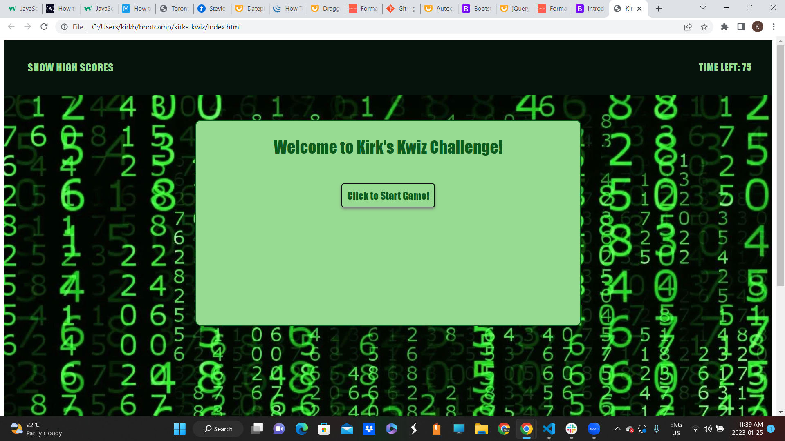

# kirks-kwiz

## Description

In this repository you will find a link to a multiple choice quiz created using HTML, CSS, and JavaScript. 

I wanted to create an application that showcased the JavaScript knowledge and skills I have attained up to this point in my coding journey.

While the basic structure of the webpage was created with markup languages, the vast majority of the work, and all of the functionality derives from my employment of JavaScript.

## Usage

To begin the quiz, click on the start button located in the main container of the page. You will be prompted to answer a question as the timer begins to tick down. Every correct answer will move you forward in the quiz, while every incorrect answer will further decrease the time remaining to complete. 

Website URL: http://kirkhagglund.github.io/kirks-kwiz/

'''md

'''

## Credits

Many thanks to the crew at Ask BCS as well as the tutor team at Calendly for helping me work through numerous issues that arose while completing this application. 

Much use was made of the Mdn Documentation regarding several aspects of this project.

Documentation on time intervals: https://developer.mozilla.org/en-US/docs/Web/API/setInterval

DOcumentation on setting local storage items: https://developer.mozilla.org/en-US/docs/Web/API/Storage/setItem

## License

MIT License Copyright (c) 2023 KirkHagglund